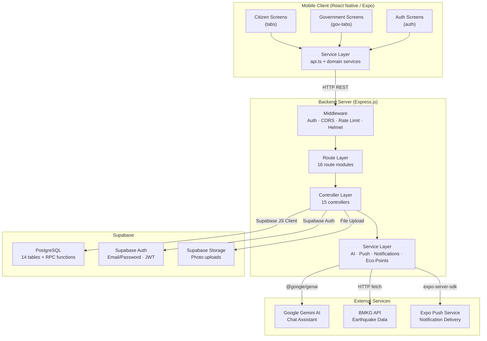
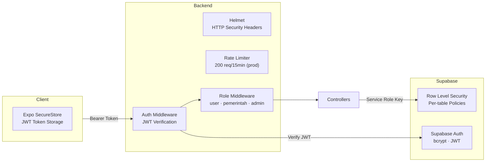
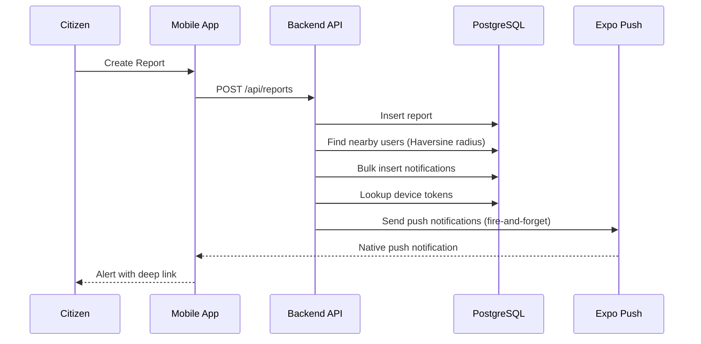

# System Architecture

This document describes the overall system architecture of SIAGA, including the relationships between components, data flow, and external service integrations.

---

## High-Level Architecture

---

## Layer Descriptions

### Mobile Client

| Layer | Responsibility |
|---|---|
| **Screens** (`app/`) | UI rendering, user interaction, navigation. Organized by role: `(tabs)` for citizens, `(gov-tabs)` for government, `(auth)` for authentication. |
| **Components** (`components/`) | Reusable UI elements: `MapPicker`, `MapView`, `SOSButton`, `Toast`, `SectionHeader`. |
| **Services** (`services/`) | HTTP communication with backend via `api.ts`. Each domain has a dedicated service file (e.g., `report.service.ts`, `action.service.ts`). |
| **Context** (`context/`) | Global state management: authentication state (`auth.tsx`), toast notifications (`toast.context.tsx`). |
| **Hooks** (`hooks/`) | Custom React hooks: GPS location (`useCurrentLocation`), push notifications (`usePushNotifications`). |

### API Client (`services/api.ts`)

The API client handles backend communication with the following features:

- **Auto-detection**: Automatically resolves the backend IP from Expo's debugger host during development. No manual configuration required.
- **Token management**: Stores JWT tokens in `expo-secure-store` and attaches them to authenticated requests.
- **Error handling**: Global network error callback system for toast notifications. Automatic token cleanup on 401 responses.
- **File uploads**: Dedicated `apiUpload()` function with multipart/form-data support.

### Backend Server

| Layer | Responsibility |
|---|---|
| **Middleware** | Request processing pipeline: JWT authentication (`auth.middleware.ts`), role-based access control (`role.middleware.ts`), input validation (`validate.middleware.ts`), global error handling (`error.middleware.ts`). |
| **Routes** | Endpoint definitions mapping HTTP methods to controller functions. 16 route modules covering all API domains. |
| **Controllers** | Business logic implementation. Handle request parsing, database operations, response formatting, and event triggering (notifications, eco-points). |
| **Services** | External service integrations: Gemini AI (`ai.service.ts`), push notifications (`push.service.ts`), notification creation with radius-based targeting (`notification.service.ts`), eco-points atomic increment (`ecopoints.service.ts`). |

### Database (Supabase)

| Component | Responsibility |
|---|---|
| **PostgreSQL** | Primary data store with 14 tables, indexes, and Row Level Security (RLS) policies. |
| **Supabase Auth** | User authentication (email/password), JWT token issuing, password reset flow. |
| **Supabase Storage** | Photo upload storage for report evidence and positive action before/after images. |
| **RPC Functions** | `increment_eco_points()` — atomic PostgreSQL function for race-condition-free point updates. |

### External Services

| Service | Integration Method | Purpose |
|---|---|---|
| **Google Gemini AI** | `@google/genai` SDK | AI-powered chat assistant with system instruction scoped to disaster preparedness, safety, and medical topics. Model: `gemini-2.0-flash`. |
| **BMKG API** | HTTP fetch + XML parsing | Real-time earthquake data. Backend proxies and converts XML to JSON using `fast-xml-parser`. |
| **Expo Push** | `expo-server-sdk` | Native push notification delivery to Android and iOS devices. Includes automatic token cleanup for expired/invalid tokens. |

---

## Security Architecture

| Layer | Mechanism |
|---|---|
| **Transport** | CORS whitelist, Helmet security headers, cache-control on sensitive endpoints. |
| **Authentication** | Supabase Auth issues JWT on login. Backend verifies JWT on every authenticated request. Tokens stored in device SecureStore. |
| **Authorization** | Role-based middleware (`user`, `pemerintah`, `admin`). Role stored in `users_metadata.role`. |
| **Database** | Row Level Security (RLS) on all tables. Service role key used by backend for server-side operations. |
| **Rate Limiting** | 200 requests per 15 minutes per IP in production, 1000 in development. |

---

## Notification Architecture

The notification system uses a radius-based targeting algorithm:

1. **Event occurs** (report created, status changed, vote, verify, comment)
2. **Backend controller** triggers the notification service
3. **Haversine formula** calculates nearby users within a configurable radius
4. **Bulk notifications** inserted into `notifications` table
5. **Push delivery** sent asynchronously via Expo Push Service
6. **Deep linking** navigates users directly to the relevant report or action on tap
