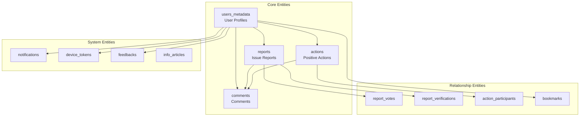
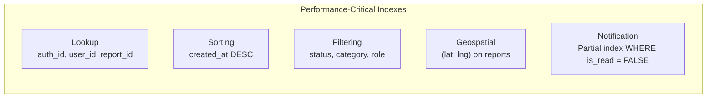

# Core Data Structures & Entities

This document describes the core data structures and entities used in **SIAGA**. All data is stored in **Supabase (PostgreSQL)** and managed through 14 sequential SQL migration files.

---

## Entity Overview



---

## 1. `users_metadata` — User Profiles

Stores extended user profile data linked to **Supabase Auth** via `auth_id`. Supports three roles: **citizen** (`user`), **government** (`pemerintah`), and **admin**.

| Column | Type | Constraint | Description |
|---|---|---|---|
| `id` | UUID | PK | Unique profile ID |
| `auth_id` | UUID | FK, UNIQUE → `auth.users` | Link to Supabase Auth account |
| `full_name` | VARCHAR(100) | NOT NULL | Full display name |
| `initials` | VARCHAR(4) | NOT NULL | Auto-generated initials |
| `email` | VARCHAR(255) | NOT NULL | Email address |
| `phone` | VARCHAR(20) | — | Phone number |
| `bio` | TEXT | — | Short biography |
| `district` | VARCHAR(100) | — | District (kecamatan) |
| `city` | VARCHAR(100) | — | City |
| `province` | VARCHAR(100) | — | Province |
| `lat` | DOUBLE PRECISION | — | Location latitude |
| `lng` | DOUBLE PRECISION | — | Location longitude |
| `eco_points` | INTEGER | DEFAULT 0 | Gamification points |
| `current_badge` | VARCHAR(50) | DEFAULT 'Warga Baru' | Active badge |
| `total_reports` | INTEGER | DEFAULT 0 | Total reports created |
| `total_actions` | INTEGER | DEFAULT 0 | Total actions joined |
| `rank` | INTEGER | DEFAULT 0 | Leaderboard rank |
| `role` | ENUM | NOT NULL | `user` \| `pemerintah` \| `admin` |
| `nip` | TEXT | — | Government employee ID (Gov only) |
| `jabatan` | TEXT | — | Position title (Gov only) |
| `instansi` | TEXT | — | Agency name (Gov only) |
| `unit_kerja` | TEXT | — | Work unit (Gov only) |
| `golongan` | TEXT | — | Civil service grade (Gov only) |
| `tmt` | TEXT | — | Effective date of appointment (Gov only) |
| `created_at` | TIMESTAMPTZ | DEFAULT NOW() | Registration time |
| `updated_at` | TIMESTAMPTZ | AUTO | Auto-updated via trigger |

**Indexes:** `auth_id`
**RLS:** Users can only read/update their own profile. Service role has full access.

---

## 2. `reports` — Issue Reports

Primary entity for environmental and social issue reports submitted by citizens. Stores GPS coordinates, photo evidence, urgency score, and **resolution proof** submitted by government officials.

| Column | Type | Constraint | Description |
|---|---|---|---|
| `id` | UUID | PK | Unique report ID |
| `user_id` | UUID | FK → `auth.users` | Reporter |
| `category` | VARCHAR(50) | NOT NULL | Category: Natural Disaster, Infrastructure, Environment, etc. |
| `type` | VARCHAR(30) | NOT NULL | Icon type: Waves, RoadHorizon, Trash, Mountains, Fire |
| `title` | VARCHAR(200) | NOT NULL | Report title |
| `description` | TEXT | NOT NULL | Detailed problem description |
| `address` | VARCHAR(300) | NOT NULL | Location address |
| `district` | VARCHAR(100) | — | District |
| `city` | VARCHAR(100) | DEFAULT 'Kota Bandung' | City |
| `lat` | DOUBLE PRECISION | NOT NULL | GPS latitude |
| `lng` | DOUBLE PRECISION | NOT NULL | GPS longitude |
| `status` | VARCHAR(20) | CHECK | `Menunggu` → `Diverifikasi` → `Ditangani` → `Selesai` |
| `urgency` | INTEGER | DEFAULT 0 | Urgency score (increases with each vote) |
| `votes_count` | INTEGER | DEFAULT 0 | Community support count |
| `verified_count` | INTEGER | DEFAULT 0 | Community verification count |
| `photos_count` | INTEGER | DEFAULT 0 | Photo evidence count |
| `comments_count` | INTEGER | DEFAULT 0 | Comment count |
| `responded_by` | VARCHAR(200) | — | Name of assigned responder |
| `estimated_completion` | TIMESTAMPTZ | — | Estimated resolution time |
| `photo_urls` | TEXT[] | DEFAULT '{}' | Photo URL array from Supabase Storage |
| `resolution_notes` | TEXT | — | Resolution proof notes (Gov only) |
| `resolution_image_url` | TEXT | — | Resolution evidence photo URL (Gov only) |
| `created_at` | TIMESTAMPTZ | DEFAULT NOW() | Report creation time |
| `updated_at` | TIMESTAMPTZ | AUTO | Auto-updated via trigger |

**Indexes:** `user_id`, `status`, `category`, `created_at DESC`, `(lat, lng)` geospatial
**RLS:** Public for SELECT. Users can only INSERT/UPDATE/DELETE their own reports.

### Report Status Workflow

```
Menunggu ──→ Diverifikasi ──→ Ditangani ──→ Selesai
   │                              ↑             ↑
   └──────────────────────────────┘         (+ resolution proof)
```

---

## 3. `actions` — Positive Actions

Community-driven activities such as tree planting, clean-ups, and infrastructure repairs that citizens can organize and join.

| Column | Type | Constraint | Description |
|---|---|---|---|
| `id` | UUID | PK | Unique action ID |
| `user_id` | UUID | FK → `auth.users` | Organizer |
| `category` | VARCHAR(50) | NOT NULL | Category: Environment, Greening, Infrastructure |
| `type` | VARCHAR(30) | NOT NULL | Icon type: Plant, Tree, RoadHorizon |
| `title` | VARCHAR(200) | NOT NULL | Activity title |
| `description` | TEXT | NOT NULL | Activity description |
| `address` | VARCHAR(300) | NOT NULL | Activity location |
| `district` | VARCHAR(100) | — | District |
| `city` | VARCHAR(100) | DEFAULT 'Kota Bandung' | City |
| `lat` | DOUBLE PRECISION | — | Latitude |
| `lng` | DOUBLE PRECISION | — | Longitude |
| `status` | VARCHAR(20) | CHECK | `Terjadwal` → `Berlangsung` → `Selesai` |
| `date` | VARCHAR(50) | — | Activity date |
| `duration` | VARCHAR(100) | — | Activity duration |
| `points` | INTEGER | DEFAULT 0 | Eco-points awarded to participants |
| `max_participants` | INTEGER | DEFAULT 0 | Maximum participant capacity |
| `total_participants` | INTEGER | DEFAULT 0 | Current participant count |
| `verified` | BOOLEAN | DEFAULT false | Verification status |
| `verified_by` | VARCHAR(200) | — | Verified by |
| `comments_count` | INTEGER | DEFAULT 0 | Comment count |
| `photo_urls` | TEXT[] | DEFAULT '{}' | Before/after photos |
| `created_at` | TIMESTAMPTZ | DEFAULT NOW() | Creation time |
| `updated_at` | TIMESTAMPTZ | AUTO | Auto-updated via trigger |

**Indexes:** `user_id`, `status`, `category`, `created_at DESC`

---

## 4. `comments` — Comments

**Polymorphic** comment system supporting comments on both reports and positive actions through `target_type` + `target_id`.

| Column | Type | Constraint | Description |
|---|---|---|---|
| `id` | UUID | PK | Unique comment ID |
| `user_id` | UUID | FK → `auth.users` | Comment author |
| `target_id` | UUID | NOT NULL | Report or action ID (polymorphic) |
| `target_type` | VARCHAR | NOT NULL | `report` \| `action` |
| `text` | TEXT | NOT NULL | Comment content |
| `likes` | INTEGER | DEFAULT 0 | Like count |
| `created_at` | TIMESTAMPTZ | DEFAULT NOW() | Comment time |

**Polymorphic Pattern:** A single table serves two entities — avoiding duplicate comment tables.

---

## 5. Relationship Tables (Many-to-Many)

### `report_votes` — Report Support

| Column | Type | Constraint |
|---|---|---|
| `id` | UUID | PK |
| `user_id` | UUID | FK → `auth.users` |
| `report_id` | UUID | FK → `reports` |
| `created_at` | TIMESTAMPTZ | DEFAULT NOW() |

**Constraint:** `UNIQUE(user_id, report_id)` — One vote per user per report.

### `report_verifications` — Report Verification

| Column | Type | Constraint |
|---|---|---|
| `id` | UUID | PK |
| `report_id` | UUID | FK → `reports` |
| `user_id` | UUID | NOT NULL |
| `created_at` | TIMESTAMPTZ | DEFAULT NOW() |

**Constraint:** `UNIQUE(report_id, user_id)` — One verification per user per report.

### `action_participants` — Action Participation

| Column | Type | Constraint |
|---|---|---|
| `id` | UUID | PK |
| `action_id` | UUID | FK → `actions` |
| `user_id` | UUID | NOT NULL |
| `joined_at` | TIMESTAMPTZ | DEFAULT NOW() |

**Constraint:** `UNIQUE(action_id, user_id)` — One join per user per action.

### `bookmarks` — Bookmarks

| Column | Type | Constraint |
|---|---|---|
| `id` | UUID | PK |
| `user_id` | UUID | NOT NULL |
| `ref_type` | VARCHAR | `report` \| `action` \| `info` |
| `ref_id` | UUID | Target ID (polymorphic) |
| `created_at` | TIMESTAMPTZ | DEFAULT NOW() |

**Constraint:** `UNIQUE(user_id, ref_type, ref_id)` — One bookmark per user per item.

---

## 6. System Tables

### `notifications` — In-App Notifications

| Column | Type | Description |
|---|---|---|
| `id` | UUID | PK |
| `user_id` | UUID | Notification recipient |
| `type` | VARCHAR | Type: `new_report`, `status_changed`, `vote`, `comment` |
| `title` | VARCHAR | Notification title |
| `message` | TEXT | Message body |
| `ref_type` | VARCHAR | Reference type: `report`, `action` |
| `ref_id` | VARCHAR | Reference ID for deep linking |
| `is_read` | BOOLEAN | Read status (default: false) |
| `created_at` | TIMESTAMPTZ | Notification time |

**Index:** Partial index on `(user_id, is_read) WHERE is_read = FALSE` for fast unread count queries.

### `device_tokens` — Push Notification Tokens

| Column | Type | Description |
|---|---|---|
| `id` | UUID | PK |
| `user_id` | UUID | Device owner |
| `token` | TEXT | Expo Push Token (UNIQUE) |
| `platform` | VARCHAR | `android` \| `ios` |
| `active` | BOOLEAN | Token active status |
| `created_at` | TIMESTAMPTZ | Registration time |
| `updated_at` | TIMESTAMPTZ | Last update |

### `feedbacks` — User Feedback

| Column | Type | Description |
|---|---|---|
| `id` | UUID | PK |
| `user_id` | UUID | Feedback author |
| `type` | VARCHAR | `saran` \| `bug` \| `pujian` \| `lainnya` |
| `rating` | INTEGER | 1–5 star rating |
| `title` | VARCHAR | Feedback title |
| `message` | TEXT | Feedback message |
| `created_at` | TIMESTAMPTZ | Submission time |

---

## 7. `info_articles` — Educational Articles

Educational content about disaster preparedness and safety, stored with a flexible JSONB format.

| Column | Type | Description |
|---|---|---|
| `id` | UUID | PK |
| `type` | VARCHAR | Article type |
| `title` | VARCHAR | Title |
| `subtitle` | TEXT | Subtitle |
| `category` | VARCHAR | Category: Disaster, Health, Environment |
| `source` | VARCHAR | Information source |
| `content` | JSONB | Article content (flexible format) |
| `photo_urls` | JSONB | Article photos |
| `tags` | JSONB | Search tags |
| `tips` | JSONB | Safety tips |
| `related_links` | JSONB | Related links |
| `author_name` | VARCHAR | Author name |
| `author_role` | VARCHAR | Author role |
| `author_organization` | VARCHAR | Author organization |
| `stats_views` | INTEGER | View count |
| `stats_shares` | INTEGER | Share count |
| `stats_bookmarks` | INTEGER | Bookmark count |
| `verified` | BOOLEAN | Verification status |
| `read_time` | VARCHAR | Estimated read time |
| `published_at` | TIMESTAMPTZ | Publication date |

---

## 8. PostgreSQL Functions

### `increment_eco_points(p_user_id UUID, p_amount INTEGER)`

Atomic RPC function for incrementing eco-points without race conditions. Called via `supabase.rpc()`.

```sql
-- Usage via Supabase RPC
SELECT increment_eco_points('user-uuid-here', 10);
```

**Trigger points:**
| Action | Points |
|---|---|
| Create a new report | +10 |
| Create a positive action | +50 |
| Verify a report | +5 |
| Vote/support a report | +2 |
| Add a comment | +2 |

### `update_updated_at_column()`

Trigger function that automatically updates the `updated_at` column on row modification. Attached to: `users_metadata`, `reports`, `actions`.

---

## 9. Data Security (Row Level Security)

All tables are protected by **Row Level Security (RLS)** with the following policies:

| Table | SELECT | INSERT | UPDATE | DELETE |
|---|---|---|---|---|
| `users_metadata` | Owner only | — | Owner only | — |
| `reports` | Public | Owner only | Owner only | Owner only |
| `actions` | Public | Owner only | Owner only | Owner only |
| `comments` | Public | Owner only | Owner only | Owner only |
| `report_votes` | Public | Owner only | — | Owner only |

> [!NOTE]
> The backend uses a **Service Role Key** for server-side operations that require cross-user access (e.g., notifications, government status updates, admin operations).

---

## 10. Indexing Strategy



| Index Type | Columns | Table | Purpose |
|---|---|---|---|
| B-tree | `auth_id` | `users_metadata` | Fast profile lookup |
| B-tree | `user_id` | `reports`, `actions` | Filter by owner |
| B-tree | `status` | `reports`, `actions` | Filter active reports |
| B-tree | `category` | `reports`, `actions` | Filter by category |
| B-tree | `created_at DESC` | All major tables | Chronological sorting |
| Composite | `(lat, lng)` | `reports` | Nearby queries (Haversine) |
| Partial | `(user_id, is_read)` | `notifications` | Fast unread count |
| Unique | `(user_id, report_id)` | `report_votes` | Vote deduplication |
