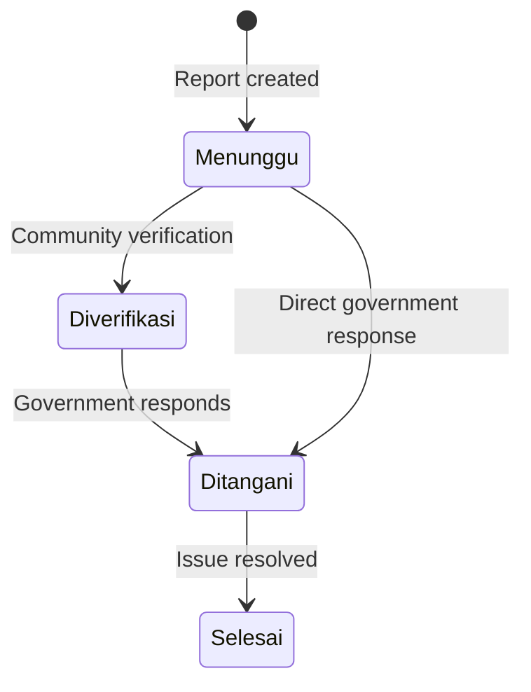
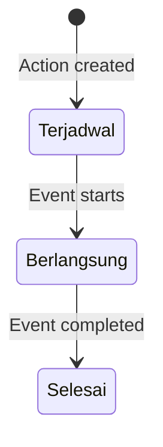

# Entity Relationship Diagram

This document describes the database schema used by SIAGA. The database is hosted on Supabase (PostgreSQL) and managed through 14 sequential SQL migration files.

---

## ER Diagram

```mermaid
erDiagram
    auth_users {
        UUID id PK
        VARCHAR email
        VARCHAR encrypted_password
        TIMESTAMPTZ created_at
    }

    users_metadata {
        UUID id PK
        UUID auth_id FK "UNIQUE → auth.users"
        VARCHAR full_name
        VARCHAR initials
        VARCHAR email
        VARCHAR phone
        TEXT bio
        VARCHAR district
        VARCHAR city
        VARCHAR province
        FLOAT lat
        FLOAT lng
        INTEGER eco_points
        VARCHAR current_badge
        INTEGER total_reports
        INTEGER total_actions
        INTEGER rank
        user_role_enum role "user | pemerintah | admin"
        TEXT nip "Gov only"
        TEXT jabatan "Gov only"
        TEXT instansi "Gov only"
        TEXT unit_kerja "Gov only"
        TEXT golongan "Gov only"
        TEXT tmt "Gov only"
        TIMESTAMPTZ created_at
        TIMESTAMPTZ updated_at
    }

    reports {
        UUID id PK
        UUID user_id FK "→ auth.users"
        VARCHAR category
        VARCHAR type
        VARCHAR title
        TEXT description
        VARCHAR address
        VARCHAR district
        VARCHAR city
        FLOAT lat
        FLOAT lng
        VARCHAR status "Menunggu | Diverifikasi | Ditangani | Selesai"
        INTEGER urgency
        INTEGER votes_count
        INTEGER verified_count
        INTEGER photos_count
        INTEGER comments_count
        VARCHAR responded_by
        TIMESTAMPTZ estimated_completion
        TEXT_ARRAY photo_urls
        TIMESTAMPTZ created_at
        TIMESTAMPTZ updated_at
    }

    actions {
        UUID id PK
        UUID user_id FK "→ auth.users"
        VARCHAR category
        VARCHAR type
        VARCHAR title
        TEXT description
        VARCHAR address
        VARCHAR district
        VARCHAR city
        FLOAT lat
        FLOAT lng
        VARCHAR status "Terjadwal | Berlangsung | Selesai"
        VARCHAR date
        VARCHAR duration
        INTEGER points
        INTEGER max_participants
        INTEGER total_participants
        BOOLEAN verified
        VARCHAR verified_by
        INTEGER comments_count
        TEXT_ARRAY photo_urls
        TIMESTAMPTZ created_at
        TIMESTAMPTZ updated_at
    }

    comments {
        UUID id PK
        UUID user_id FK "→ auth.users"
        UUID target_id "Polymorphic"
        VARCHAR target_type "report | action"
        TEXT text
        INTEGER likes
        TIMESTAMPTZ created_at
    }

    report_votes {
        UUID id PK
        UUID user_id FK "→ auth.users"
        UUID report_id FK "→ reports"
        TIMESTAMPTZ created_at
    }

    report_verifications {
        UUID id PK
        UUID report_id FK "→ reports"
        UUID user_id
        TIMESTAMPTZ created_at
    }

    action_participants {
        UUID id PK
        UUID action_id FK "→ actions"
        UUID user_id
        TIMESTAMPTZ joined_at
    }

    bookmarks {
        UUID id PK
        UUID user_id
        VARCHAR ref_type "report | action | info"
        UUID ref_id "Polymorphic"
        TIMESTAMPTZ created_at
    }

    notifications {
        UUID id PK
        UUID user_id
        VARCHAR type
        VARCHAR title
        TEXT message
        VARCHAR ref_type
        VARCHAR ref_id
        BOOLEAN is_read
        TIMESTAMPTZ created_at
    }

    feedbacks {
        UUID id PK
        UUID user_id
        VARCHAR type "saran | bug | pujian | lainnya"
        INTEGER rating "1-5"
        VARCHAR title
        TEXT message
        TIMESTAMPTZ created_at
    }

    device_tokens {
        UUID id PK
        UUID user_id
        TEXT token "UNIQUE"
        VARCHAR platform "android | ios"
        BOOLEAN active
        TIMESTAMPTZ updated_at
        TIMESTAMPTZ created_at
    }

    info_articles {
        UUID id PK
        VARCHAR type
        VARCHAR title
        TEXT subtitle
        VARCHAR category
        VARCHAR source
        VARCHAR color
        VARCHAR bg
        VARCHAR gradient
        JSONB content
        JSONB photo_urls
        JSONB tags
        JSONB tips
        JSONB related_links
        VARCHAR author_name
        VARCHAR author_initials
        VARCHAR author_role
        VARCHAR author_organization
        INTEGER stats_views
        INTEGER stats_shares
        INTEGER stats_bookmarks
        BOOLEAN verified
        VARCHAR verified_by
        VARCHAR read_time
        TIMESTAMPTZ published_at
        TIMESTAMPTZ updated_at
        TIMESTAMPTZ created_at
    }

    budget_projects {
        VARCHAR id PK
        VARCHAR title
        VARCHAR org
        VARCHAR kec
        VARCHAR icon
        VARCHAR icon_color
        VARCHAR bg_color
        VARCHAR status
        BIGINT budget
        INTEGER realisasi
        INTEGER fisik
        VARCHAR deadline
        TEXT anomali_note
        TIMESTAMPTZ created_at
        TIMESTAMPTZ updated_at
    }

    budget_dinas {
        UUID id PK
        VARCHAR name
        VARCHAR short
        VARCHAR budget
        INTEGER serap
        VARCHAR color
        VARCHAR bg
        VARCHAR status
        TIMESTAMPTZ created_at
    }

    auth_users ||--|| users_metadata : "has profile"
    auth_users ||--o{ reports : "creates"
    auth_users ||--o{ actions : "creates"
    auth_users ||--o{ comments : "writes"
    auth_users ||--o{ report_votes : "votes"
    auth_users ||--o{ report_verifications : "verifies"
    auth_users ||--o{ action_participants : "joins"
    auth_users ||--o{ bookmarks : "bookmarks"
    auth_users ||--o{ notifications : "receives"
    auth_users ||--o{ feedbacks : "submits"
    auth_users ||--o{ device_tokens : "registers"

    reports ||--o{ report_votes : "has votes"
    reports ||--o{ report_verifications : "has verifications"
    reports ||--o{ comments : "has comments"

    actions ||--o{ action_participants : "has participants"
    actions ||--o{ comments : "has comments"
```

---

## Table Descriptions

### Core Tables

| Table | Description | RLS |
|---|---|---|
| `users_metadata` | Extended user profiles linked to Supabase Auth via `auth_id`. Stores location, eco-points, gamification badges, and government-specific fields (NIP, jabatan, instansi). | Yes |
| `reports` | Issue reports submitted by citizens. Contains GPS coordinates, category, urgency score, status workflow, and photo URLs. | Yes |
| `actions` | Positive community actions. Tracks participants, points, verification status, and before/after photos. | Yes |
| `comments` | Polymorphic comments on reports and actions via `target_id` + `target_type`. | Yes |

### Relationship Tables

| Table | Description | Constraint |
|---|---|---|
| `report_votes` | Tracks which users voted/supported which reports. | `UNIQUE(user_id, report_id)` |
| `report_verifications` | Tracks which users verified which reports. | `UNIQUE(report_id, user_id)` |
| `action_participants` | Tracks which users joined which actions. | `UNIQUE(action_id, user_id)` |
| `bookmarks` | Polymorphic bookmarks for reports, actions, and info articles. | `UNIQUE(user_id, ref_type, ref_id)` |

### System Tables

| Table | Description |
|---|---|
| `notifications` | In-app notification inbox with read/unread state. References source entity via `ref_type` and `ref_id`. |
| `device_tokens` | Push notification token registry. Each device registers its Expo push token. Supports auto-cleanup of invalid tokens. |
| `feedbacks` | User feedback submissions with type classification and 1-5 star rating. |

### Content Tables

| Table | Description |
|---|---|
| `info_articles` | Education and information articles with rich JSONB content, author metadata, statistics, and verification status. |
| `budget_projects` | Government budget projects with budget allocation, realization percentage, physical progress, and anomaly tracking. |
| `budget_dinas` | Budget absorption per government department/agency. |

### Functions

| Function | Description |
|---|---|
| `increment_eco_points(p_user_id, p_amount)` | Atomic PostgreSQL function for race-condition-free eco-points incrementation. Called via Supabase RPC. |
| `update_updated_at_column()` | Trigger function that automatically updates `updated_at` on row modification. |

---

## Status Workflows

### Report Status

### Action Status

---

## Indexes

Performance-critical indexes are defined on:

- **Lookup**: `auth_id`, `user_id`, `report_id`, `action_id`, `target_id`
- **Sorting**: `created_at DESC` on all major tables
- **Filtering**: `status`, `category`, `role`
- **Geospatial**: `(lat, lng)` on reports for nearby queries
- **Notifications**: Partial index on `(user_id, is_read) WHERE is_read = FALSE` for fast unread count

---

## Migration History

| # | File | Description |
|---|---|---|
| 001 | `create_users_metadata.sql` | User profiles, RLS, updated_at trigger |
| 002 | `create_reports.sql` | Reports table with geospatial index |
| 003 | `create_actions.sql` | Positive actions table |
| 004 | `create_comments.sql` | Polymorphic comments |
| 005 | `create_report_votes.sql` | Vote deduplication |
| 006 | `create_feedbacks.sql` | User feedback |
| 007 | `create_notifications.sql` | Notification inbox |
| 008 | `create_budget.sql` | Budget tables with seed data |
| 009 | `add_user_role.sql` | Role enum and column |
| 010 | `verify_join_bookmark.sql` | Verification, participation, bookmarks |
| 011 | `info_articles.sql` | Articles with seed data |
| 012 | `create_device_tokens.sql` | Push token registry |
| 013 | `increment_eco_points.sql` | Atomic increment RPC function |
| 014 | `add_gov_profile_fields.sql` | Government-specific profile columns |
