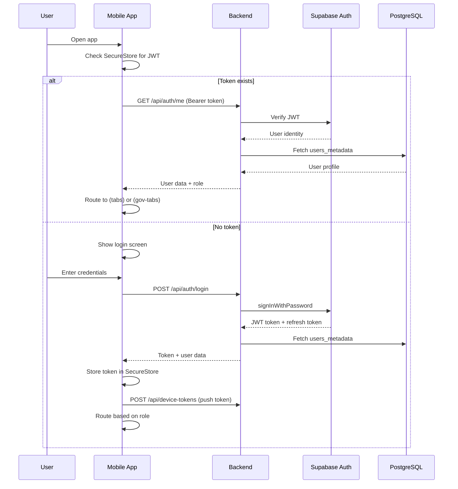
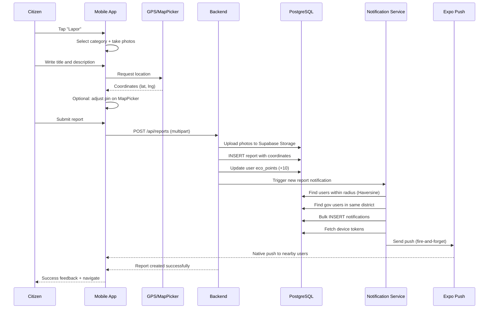
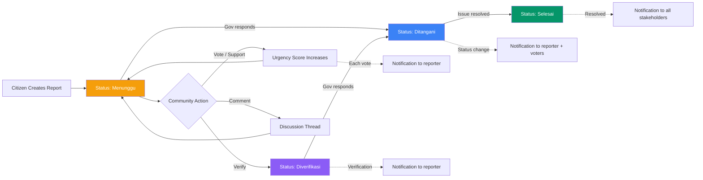
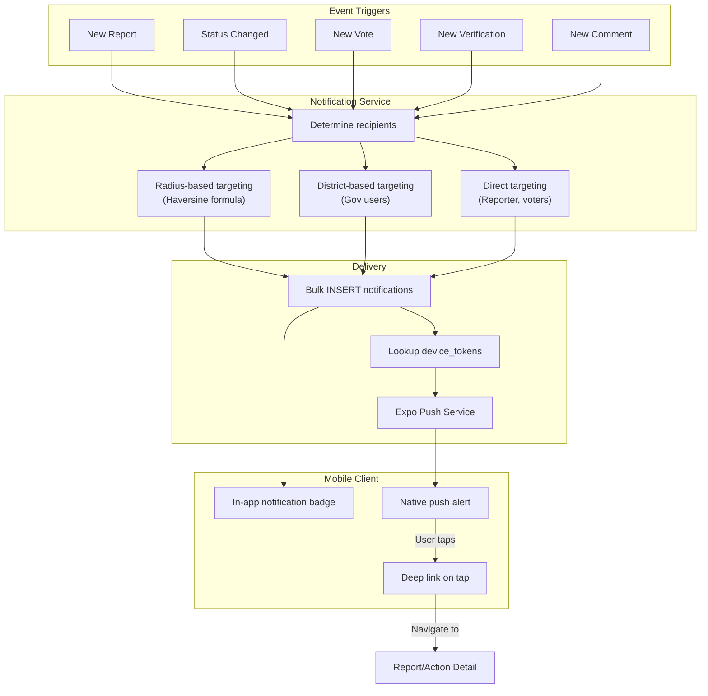
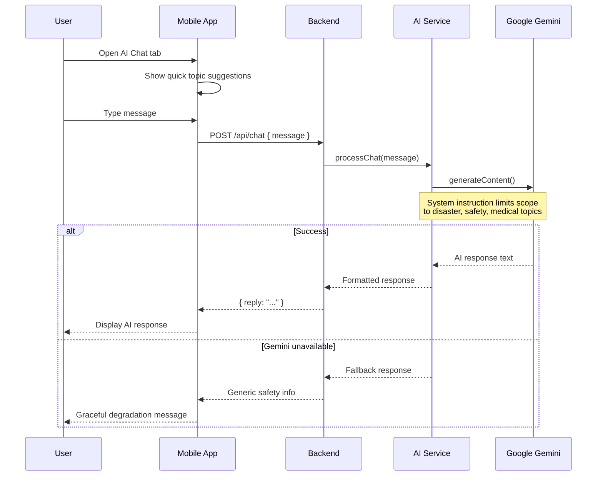
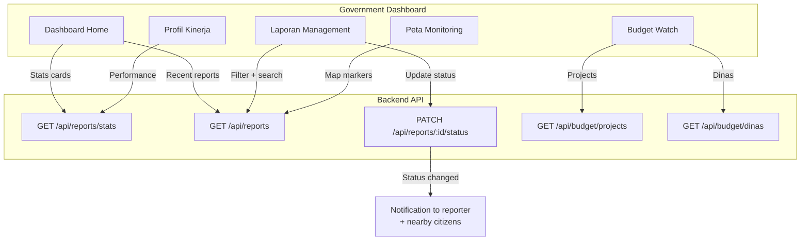
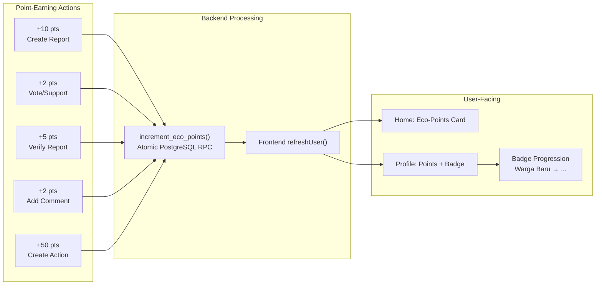
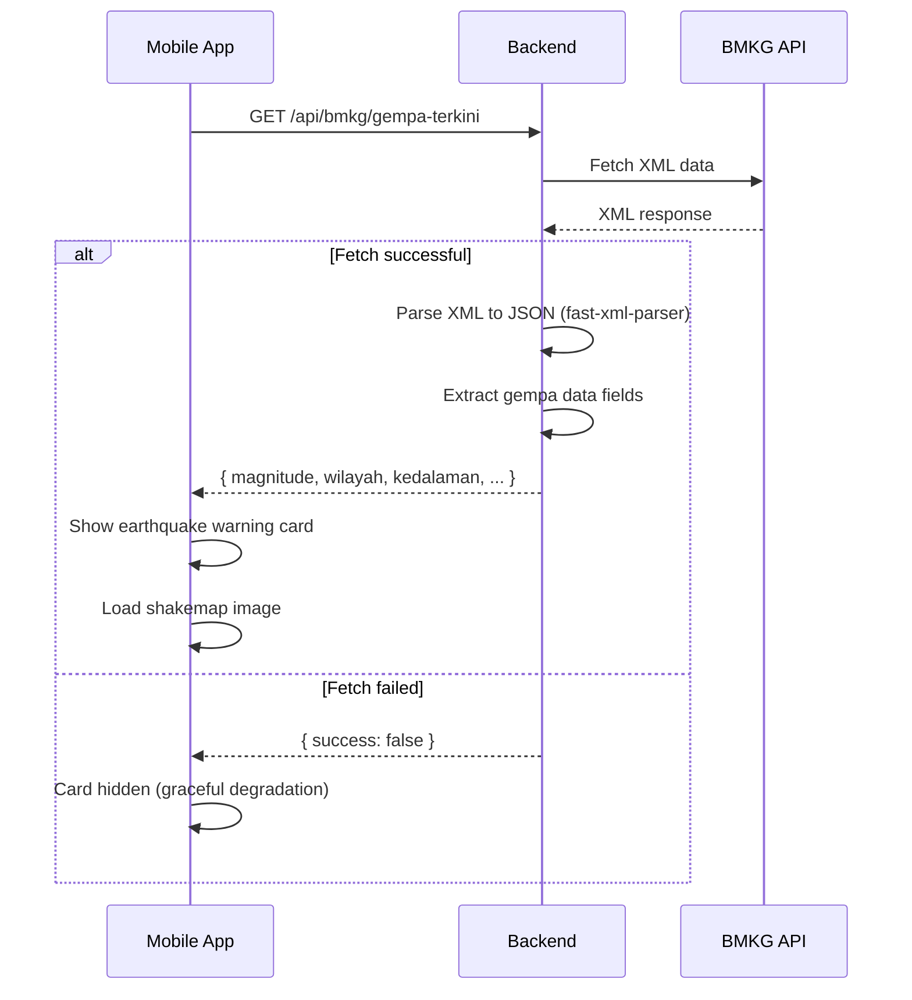

# System Flow Diagrams

This document describes the core user journeys and process flows in SIAGA.

---

## 1. Authentication Flow

---

## 2. Report Creation Flow

---

## 3. Report Lifecycle

---

## 4. Push Notification Flow

---

## 5. AI Chat Flow

---

## 6. Government Dashboard Flow

---

## 7. Eco-Points Flow

---

## 8. BMKG Earthquake Integration

