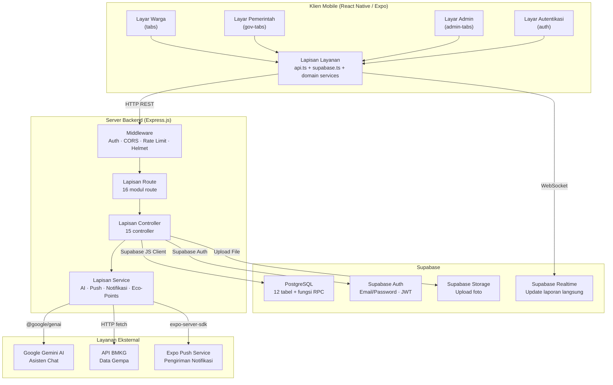
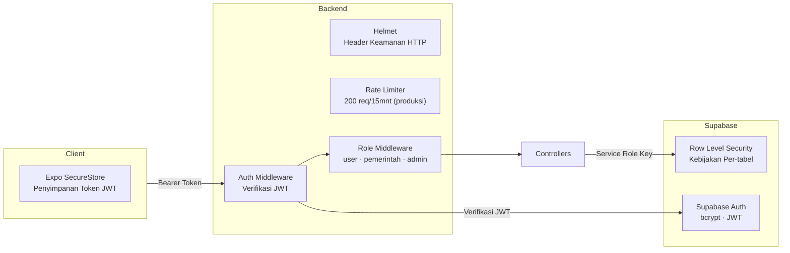
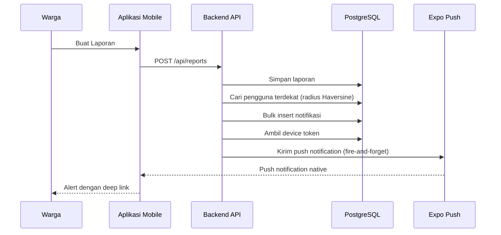

# Arsitektur Sistem

Dokumen ini menjelaskan arsitektur sistem SIAGA secara keseluruhan, termasuk hubungan antar komponen, alur data, dan integrasi layanan eksternal.

---

## Arsitektur Tingkat Tinggi

---

## Deskripsi Lapisan

### Klien Mobile

| Lapisan | Tanggung Jawab |
|---|---|
| **Layar** (`app/`) | Rendering UI, interaksi pengguna, navigasi. Diorganisir berdasarkan peran: `(tabs)` untuk warga, `(gov-tabs)` untuk pemerintah, `(admin-tabs)` untuk super-admin, `(auth)` untuk autentikasi. |
| **Komponen** (`components/`) | Elemen UI yang dapat digunakan ulang: `MapPicker`, `MapView`, `SOSButton`, `Toast`, `SectionHeader`. |
| **Layanan** (`services/`) | Komunikasi HTTP dengan backend via `api.ts`. Supabase Realtime via `supabase.ts`. Setiap domain memiliki file layanan tersendiri (contoh: `report.service.ts`, `admin.service.ts`). |
| **Context** (`context/`) | Manajemen state global: state autentikasi (`auth.tsx`), notifikasi toast (`toast.context.tsx`). |
| **Hooks** (`hooks/`) | Custom React hooks: lokasi GPS (`useCurrentLocation`), push notification (`usePushNotifications`). |

### Klien API (`services/api.ts`)

Klien API menangani komunikasi backend dengan fitur-fitur berikut:

- **Auto-deteksi**: Secara otomatis menemukan IP backend dari Expo debugger host saat development. Tidak perlu konfigurasi manual.
- **Manajemen token**: Menyimpan token JWT di `expo-secure-store` dan melampirkannya ke permintaan terautentikasi.
- **Penanganan error**: Sistem callback error jaringan global untuk notifikasi toast. Pembersihan token otomatis pada respons 401.
- **Upload file**: Fungsi `apiUpload()` khusus dengan dukungan multipart/form-data.

### Klien Supabase (`services/supabase.ts`)

Klien Supabase langsung digunakan untuk **langganan Realtime** — layar detail laporan berlangganan perubahan tingkat baris pada tabel `reports`, memungkinkan pembaruan UI instan saat pejabat pemerintah menyelesaikan atau memperbarui laporan tanpa perlu refresh manual.

### Server Backend

| Lapisan | Tanggung Jawab |
|---|---|
| **Middleware** | Pipeline pemrosesan permintaan: autentikasi JWT (`auth.middleware.ts`), kontrol akses berbasis peran (`role.middleware.ts`), validasi input (`validate.middleware.ts`), penanganan error global (`error.middleware.ts`). |
| **Routes** | Definisi endpoint yang memetakan metode HTTP ke fungsi controller. 16 modul route mencakup semua domain API termasuk admin. |
| **Controllers** | Implementasi logika bisnis. Menangani parsing permintaan, operasi database, format respons, dan pemicuan event (notifikasi, eco-points). Termasuk `admin.controller.ts` untuk operasi super-admin. |
| **Services** | Integrasi layanan eksternal: Gemini AI (`ai.service.ts`), push notification (`push.service.ts`), pembuatan notifikasi dengan penargetan berbasis radius (`notification.service.ts`), increment eco-points atomik (`ecopoints.service.ts`). |

### Database (Supabase)

| Komponen | Tanggung Jawab |
|---|---|
| **PostgreSQL** | Penyimpanan data utama dengan 12 tabel, indeks, dan kebijakan Row Level Security (RLS). |
| **Supabase Auth** | Autentikasi pengguna (email/password), penerbitan token JWT, alur reset password. |
| **Supabase Storage** | Penyimpanan upload foto untuk bukti laporan, bukti resolusi, dan foto sebelum/sesudah aksi positif. |
| **Supabase Realtime** | Langganan langsung berbasis WebSocket untuk tabel `reports`, memungkinkan pembaruan UI instan pada klien mobile. |
| **Fungsi RPC** | `increment_eco_points()` — fungsi PostgreSQL atomik untuk pembaruan poin bebas race condition. |

### Layanan Eksternal

| Layanan | Metode Integrasi | Tujuan |
|---|---|---|
| **Google Gemini AI** | SDK `@google/genai` | Asisten chat bertenaga AI dengan instruksi sistem terbatas pada topik kesiapsiagaan bencana, keselamatan, dan medis. Model: `gemini-2.0-flash`. |
| **API BMKG** | HTTP fetch + parsing XML | Data gempa real-time. Backend mem-proxy dan mengonversi XML ke JSON menggunakan `fast-xml-parser`. |
| **Expo Push** | `expo-server-sdk` | Pengiriman push notification native ke perangkat Android dan iOS. Termasuk pembersihan otomatis token yang kedaluwarsa/tidak valid. |

---

## Arsitektur Keamanan

| Lapisan | Mekanisme |
|---|---|
| **Transport** | Whitelist CORS, header keamanan Helmet, cache-control pada endpoint sensitif. |
| **Autentikasi** | Supabase Auth menerbitkan JWT saat login. Backend memverifikasi JWT pada setiap permintaan terautentikasi. Token disimpan di SecureStore perangkat. |
| **Otorisasi** | Middleware berbasis peran (`user`, `pemerintah`, `admin`). Peran disimpan di `users_metadata.role`. Endpoint admin dilindungi oleh `requireRoles(['admin'])`. |
| **Database** | Row Level Security (RLS) pada semua tabel. Service role key digunakan backend untuk operasi sisi server. |
| **Rate Limiting** | 200 permintaan per 15 menit per IP di produksi, 1000 di development. |

---

## Arsitektur Notifikasi

Sistem notifikasi menggunakan algoritma penargetan berbasis radius:

1. **Event terjadi** (laporan dibuat, status berubah, vote, verifikasi, komentar)
2. **Backend controller** memicu layanan notifikasi
3. **Rumus Haversine** menghitung pengguna terdekat dalam radius yang dapat dikonfigurasi
4. **Notifikasi massal** dimasukkan ke tabel `notifications`
5. **Pengiriman push** dikirim secara asinkron melalui Expo Push Service
6. **Deep linking** mengarahkan pengguna langsung ke laporan atau aksi terkait saat diketuk
