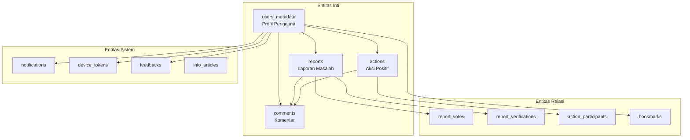
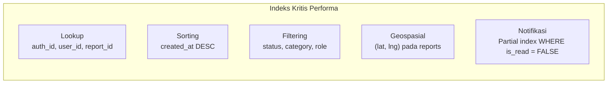

# Struktur Data Utama & Entitas

Dokumen ini menjelaskan struktur data utama dan entitas yang digunakan dalam sistem **SIAGA**. Seluruh data disimpan di **Supabase (PostgreSQL)** dan dikelola melalui 14 file migrasi SQL sekuensial.

---

## Ringkasan Entitas



---

## 1. `users_metadata` — Profil Pengguna

Menyimpan data profil pengguna yang terhubung dengan **Supabase Auth** melalui `auth_id`. Mendukung tiga peran: **warga** (`user`), **pemerintah**, dan **admin**.

| Kolom | Tipe | Constraint | Deskripsi |
|---|---|---|---|
| `id` | UUID | PK | ID unik profil |
| `auth_id` | UUID | FK, UNIQUE → `auth.users` | Link ke akun Supabase Auth |
| `full_name` | VARCHAR(100) | NOT NULL | Nama lengkap pengguna |
| `initials` | VARCHAR(4) | NOT NULL | Inisial nama (auto-generated) |
| `email` | VARCHAR(255) | NOT NULL | Alamat email |
| `phone` | VARCHAR(20) | — | Nomor telepon |
| `bio` | TEXT | — | Biografi singkat |
| `district` | VARCHAR(100) | — | Kecamatan |
| `city` | VARCHAR(100) | — | Kota |
| `province` | VARCHAR(100) | — | Provinsi |
| `lat` | DOUBLE PRECISION | — | Latitude lokasi |
| `lng` | DOUBLE PRECISION | — | Longitude lokasi |
| `eco_points` | INTEGER | DEFAULT 0 | Poin gamifikasi |
| `current_badge` | VARCHAR(50) | DEFAULT 'Warga Baru' | Badge aktif |
| `total_reports` | INTEGER | DEFAULT 0 | Total laporan dibuat |
| `total_actions` | INTEGER | DEFAULT 0 | Total aksi diikuti |
| `rank` | INTEGER | DEFAULT 0 | Peringkat leaderboard |
| `role` | ENUM | NOT NULL | `user` \| `pemerintah` \| `admin` |
| `nip` | TEXT | — | NIP pegawai (khusus pemerintah) |
| `jabatan` | TEXT | — | Jabatan (khusus pemerintah) |
| `instansi` | TEXT | — | Instansi (khusus pemerintah) |
| `unit_kerja` | TEXT | — | Unit kerja (khusus pemerintah) |
| `golongan` | TEXT | — | Golongan (khusus pemerintah) |
| `tmt` | TEXT | — | Terhitung Mulai Tanggal (khusus pemerintah) |
| `created_at` | TIMESTAMPTZ | DEFAULT NOW() | Waktu registrasi |
| `updated_at` | TIMESTAMPTZ | AUTO | Auto-update via trigger |

**Indeks:** `auth_id`
**RLS:** User hanya bisa baca/ubah profil sendiri. Service role akses penuh.

---

## 2. `reports` — Laporan Masalah

Entitas utama untuk laporan permasalahan lingkungan dan sosial yang dibuat oleh warga. Menyimpan koordinat GPS, foto bukti, skor urgensi, dan **bukti resolusi** dari pemerintah.

| Kolom | Tipe | Constraint | Deskripsi |
|---|---|---|---|
| `id` | UUID | PK | ID unik laporan |
| `user_id` | UUID | FK → `auth.users` | Pelapor |
| `category` | VARCHAR(50) | NOT NULL | Kategori: Bencana Alam, Infrastruktur, Lingkungan, dll |
| `type` | VARCHAR(30) | NOT NULL | Tipe ikon: Waves, RoadHorizon, Trash, Mountains, Fire |
| `title` | VARCHAR(200) | NOT NULL | Judul laporan |
| `description` | TEXT | NOT NULL | Deskripsi detail masalah |
| `address` | VARCHAR(300) | NOT NULL | Alamat lokasi |
| `district` | VARCHAR(100) | — | Kecamatan |
| `city` | VARCHAR(100) | DEFAULT 'Kota Bandung' | Kota |
| `lat` | DOUBLE PRECISION | NOT NULL | Latitude GPS |
| `lng` | DOUBLE PRECISION | NOT NULL | Longitude GPS |
| `status` | VARCHAR(20) | CHECK | `Menunggu` → `Diverifikasi` → `Ditangani` → `Selesai` |
| `urgency` | INTEGER | DEFAULT 0 | Skor urgensi (naik setiap vote) |
| `votes_count` | INTEGER | DEFAULT 0 | Jumlah dukungan warga |
| `verified_count` | INTEGER | DEFAULT 0 | Jumlah verifikasi warga |
| `photos_count` | INTEGER | DEFAULT 0 | Jumlah foto bukti |
| `comments_count` | INTEGER | DEFAULT 0 | Jumlah komentar |
| `responded_by` | VARCHAR(200) | — | Nama penanggung jawab penanganan |
| `estimated_completion` | TIMESTAMPTZ | — | Estimasi waktu penyelesaian |
| `photo_urls` | TEXT[] | DEFAULT '{}' | Array URL foto dari Supabase Storage |
| `resolution_notes` | TEXT | — | Catatan bukti resolusi (khusus pemerintah) |
| `resolution_image_url` | TEXT | — | URL foto bukti resolusi (khusus pemerintah) |
| `created_at` | TIMESTAMPTZ | DEFAULT NOW() | Waktu pelaporan |
| `updated_at` | TIMESTAMPTZ | AUTO | Auto-update via trigger |

**Indeks:** `user_id`, `status`, `category`, `created_at DESC`, `(lat, lng)` geospasial
**RLS:** Publik untuk SELECT. User hanya bisa INSERT/UPDATE/DELETE miliknya sendiri.

### Alur Status Laporan

```
Menunggu ──→ Diverifikasi ──→ Ditangani ──→ Selesai
   │                              ↑             ↑
   └──────────────────────────────┘         (+ bukti resolusi)
```

---

## 3. `actions` — Aksi Positif

Kegiatan komunitas yang dapat diikuti oleh warga, seperti penghijauan, bersih-bersih, dan perbaikan infrastruktur.

| Kolom | Tipe | Constraint | Deskripsi |
|---|---|---|---|
| `id` | UUID | PK | ID unik aksi |
| `user_id` | UUID | FK → `auth.users` | Penyelenggara |
| `category` | VARCHAR(50) | NOT NULL | Kategori: Lingkungan, Penghijauan, Infrastruktur |
| `type` | VARCHAR(30) | NOT NULL | Tipe ikon: Plant, Tree, RoadHorizon |
| `title` | VARCHAR(200) | NOT NULL | Judul kegiatan |
| `description` | TEXT | NOT NULL | Deskripsi kegiatan |
| `address` | VARCHAR(300) | NOT NULL | Lokasi kegiatan |
| `district` | VARCHAR(100) | — | Kecamatan |
| `city` | VARCHAR(100) | DEFAULT 'Kota Bandung' | Kota |
| `lat` | DOUBLE PRECISION | — | Latitude |
| `lng` | DOUBLE PRECISION | — | Longitude |
| `status` | VARCHAR(20) | CHECK | `Terjadwal` → `Berlangsung` → `Selesai` |
| `date` | VARCHAR(50) | — | Tanggal pelaksanaan |
| `duration` | VARCHAR(100) | — | Durasi kegiatan |
| `points` | INTEGER | DEFAULT 0 | Eco-points yang didapat peserta |
| `max_participants` | INTEGER | DEFAULT 0 | Kuota maksimal peserta |
| `total_participants` | INTEGER | DEFAULT 0 | Jumlah peserta aktif |
| `verified` | BOOLEAN | DEFAULT false | Status verifikasi kegiatan |
| `verified_by` | VARCHAR(200) | — | Pihak yang memverifikasi |
| `comments_count` | INTEGER | DEFAULT 0 | Jumlah komentar |
| `photo_urls` | TEXT[] | DEFAULT '{}' | Foto sebelum/sesudah kegiatan |
| `created_at` | TIMESTAMPTZ | DEFAULT NOW() | Waktu pembuatan |
| `updated_at` | TIMESTAMPTZ | AUTO | Auto-update via trigger |

**Indeks:** `user_id`, `status`, `category`, `created_at DESC`

---

## 4. `comments` — Komentar

Sistem komentar **polimorfik** yang mendukung komentar pada laporan dan aksi positif menggunakan `target_type` + `target_id`.

| Kolom | Tipe | Constraint | Deskripsi |
|---|---|---|---|
| `id` | UUID | PK | ID unik komentar |
| `user_id` | UUID | FK → `auth.users` | Penulis komentar |
| `target_id` | UUID | NOT NULL | ID laporan atau aksi (polimorfik) |
| `target_type` | VARCHAR | NOT NULL | `report` \| `action` |
| `text` | TEXT | NOT NULL | Isi komentar |
| `likes` | INTEGER | DEFAULT 0 | Jumlah like |
| `created_at` | TIMESTAMPTZ | DEFAULT NOW() | Waktu komentar |

**Pola Polimorfik:** Satu tabel melayani dua entitas — menghindari duplikasi tabel komentar.

---

## 5. Tabel Relasi (Many-to-Many)

### `report_votes` — Dukungan Laporan

| Kolom | Tipe | Constraint |
|---|---|---|
| `id` | UUID | PK |
| `user_id` | UUID | FK → `auth.users` |
| `report_id` | UUID | FK → `reports` |
| `created_at` | TIMESTAMPTZ | DEFAULT NOW() |

**Constraint:** `UNIQUE(user_id, report_id)` — Satu user hanya bisa vote satu kali per laporan.

### `report_verifications` — Verifikasi Laporan

| Kolom | Tipe | Constraint |
|---|---|---|
| `id` | UUID | PK |
| `report_id` | UUID | FK → `reports` |
| `user_id` | UUID | NOT NULL |
| `created_at` | TIMESTAMPTZ | DEFAULT NOW() |

**Constraint:** `UNIQUE(report_id, user_id)` — Satu user hanya bisa verifikasi satu kali per laporan.

### `action_participants` — Peserta Aksi

| Kolom | Tipe | Constraint |
|---|---|---|
| `id` | UUID | PK |
| `action_id` | UUID | FK → `actions` |
| `user_id` | UUID | NOT NULL |
| `joined_at` | TIMESTAMPTZ | DEFAULT NOW() |

**Constraint:** `UNIQUE(action_id, user_id)` — Satu user hanya bisa bergabung satu kali per aksi.

### `bookmarks` — Bookmark

| Kolom | Tipe | Constraint |
|---|---|---|
| `id` | UUID | PK |
| `user_id` | UUID | NOT NULL |
| `ref_type` | VARCHAR | `report` \| `action` \| `info` |
| `ref_id` | UUID | ID target (polimorfik) |
| `created_at` | TIMESTAMPTZ | DEFAULT NOW() |

**Constraint:** `UNIQUE(user_id, ref_type, ref_id)` — Bookmark unik per user per item.

---

## 6. Tabel Sistem

### `notifications` — Notifikasi In-App

| Kolom | Tipe | Deskripsi |
|---|---|---|
| `id` | UUID | PK |
| `user_id` | UUID | Penerima notifikasi |
| `type` | VARCHAR | Tipe: `new_report`, `status_changed`, `vote`, `comment` |
| `title` | VARCHAR | Judul notifikasi |
| `message` | TEXT | Isi pesan |
| `ref_type` | VARCHAR | Referensi tipe: `report`, `action` |
| `ref_id` | VARCHAR | ID referensi untuk deep linking |
| `is_read` | BOOLEAN | Status baca (default: false) |
| `created_at` | TIMESTAMPTZ | Waktu notifikasi |

**Indeks:** Partial index pada `(user_id, is_read) WHERE is_read = FALSE` untuk query jumlah belum dibaca yang cepat.

### `device_tokens` — Token Push Notification

| Kolom | Tipe | Deskripsi |
|---|---|---|
| `id` | UUID | PK |
| `user_id` | UUID | Pemilik perangkat |
| `token` | TEXT | Expo Push Token (UNIQUE) |
| `platform` | VARCHAR | `android` \| `ios` |
| `active` | BOOLEAN | Status aktif token |
| `created_at` | TIMESTAMPTZ | Waktu registrasi |
| `updated_at` | TIMESTAMPTZ | Update terakhir |

### `feedbacks` — Feedback Pengguna

| Kolom | Tipe | Deskripsi |
|---|---|---|
| `id` | UUID | PK |
| `user_id` | UUID | Pengirim feedback |
| `type` | VARCHAR | `saran` \| `bug` \| `pujian` \| `lainnya` |
| `rating` | INTEGER | Rating 1–5 bintang |
| `title` | VARCHAR | Judul feedback |
| `message` | TEXT | Isi feedback |
| `created_at` | TIMESTAMPTZ | Waktu submit |

---

## 7. `info_articles` — Artikel Edukasi

Konten edukasi tentang kesiapsiagaan bencana dan keselamatan, dengan format JSONB yang fleksibel.

| Kolom | Tipe | Deskripsi |
|---|---|---|
| `id` | UUID | PK |
| `type` | VARCHAR | Tipe artikel |
| `title` | VARCHAR | Judul |
| `subtitle` | TEXT | Subjudul |
| `category` | VARCHAR | Kategori: Bencana, Kesehatan, Lingkungan |
| `source` | VARCHAR | Sumber informasi |
| `content` | JSONB | Konten artikel (format fleksibel) |
| `photo_urls` | JSONB | Foto-foto artikel |
| `tags` | JSONB | Tag pencarian |
| `tips` | JSONB | Tips keselamatan |
| `related_links` | JSONB | Link terkait |
| `author_name` | VARCHAR | Nama penulis |
| `author_role` | VARCHAR | Peran penulis |
| `author_organization` | VARCHAR | Organisasi penulis |
| `stats_views` | INTEGER | Jumlah dibaca |
| `stats_shares` | INTEGER | Jumlah dibagikan |
| `stats_bookmarks` | INTEGER | Jumlah di-bookmark |
| `verified` | BOOLEAN | Status verifikasi |
| `read_time` | VARCHAR | Estimasi waktu baca |
| `published_at` | TIMESTAMPTZ | Waktu publikasi |

---

## 8. Fungsi PostgreSQL

### `increment_eco_points(p_user_id UUID, p_amount INTEGER)`

Fungsi RPC atomik untuk menambah eco-points tanpa race condition. Dipanggil menggunakan `supabase.rpc()`.

```sql
-- Penggunaan via Supabase RPC
SELECT increment_eco_points('user-uuid-here', 10);
```

**Pemicu poin:**
| Aksi | Poin |
|---|---|
| Membuat laporan baru | +10 |
| Membuat aksi positif | +50 |
| Verifikasi laporan | +5 |
| Vote/dukungan laporan | +2 |
| Menambah komentar | +2 |

### `update_updated_at_column()`

Fungsi trigger yang otomatis memperbarui kolom `updated_at` saat ada perubahan pada baris data. Terpasang di tabel: `users_metadata`, `reports`, `actions`.

---

## 9. Keamanan Data (Row Level Security)

Semua tabel dilindungi oleh **Row Level Security (RLS)** dengan kebijakan berikut:

| Tabel | SELECT | INSERT | UPDATE | DELETE |
|---|---|---|---|---|
| `users_metadata` | Pemilik saja | — | Pemilik saja | — |
| `reports` | Publik | Pemilik saja | Pemilik saja | Pemilik saja |
| `actions` | Publik | Pemilik saja | Pemilik saja | Pemilik saja |
| `comments` | Publik | Pemilik saja | Pemilik saja | Pemilik saja |
| `report_votes` | Publik | Pemilik saja | — | Pemilik saja |

> [!NOTE]
> Backend menggunakan **Service Role Key** untuk operasi sisi server yang memerlukan akses lintas-pengguna (contoh: notifikasi, update status oleh pemerintah, operasi admin).

---

## 10. Strategi Indexing



| Jenis Indeks | Kolom | Tabel | Tujuan |
|---|---|---|---|
| B-tree | `auth_id` | `users_metadata` | Lookup profil cepat |
| B-tree | `user_id` | `reports`, `actions` | Filter berdasarkan pemilik |
| B-tree | `status` | `reports`, `actions` | Filter laporan aktif |
| B-tree | `category` | `reports`, `actions` | Filter per kategori |
| B-tree | `created_at DESC` | Semua tabel utama | Sorting kronologis |
| Composite | `(lat, lng)` | `reports` | Query terdekat (Haversine) |
| Partial | `(user_id, is_read)` | `notifications` | Jumlah belum dibaca cepat |
| Unique | `(user_id, report_id)` | `report_votes` | Deduplikasi vote |
