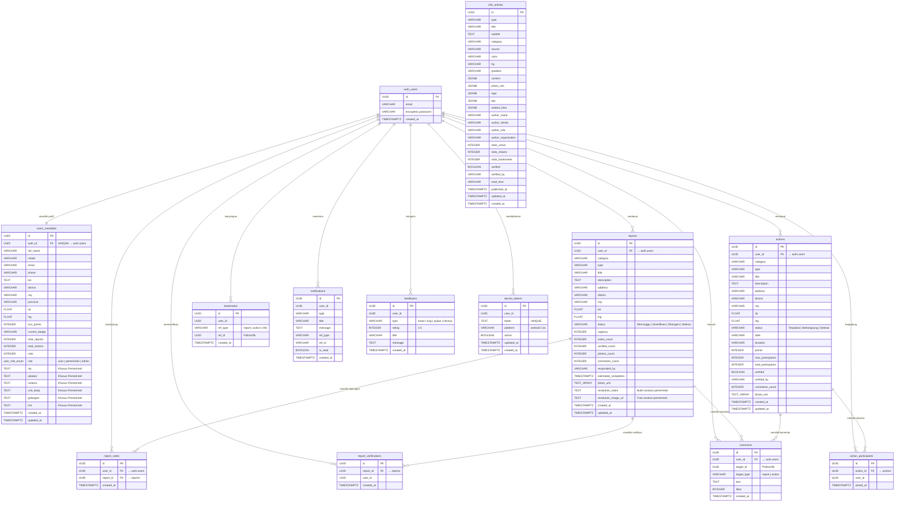
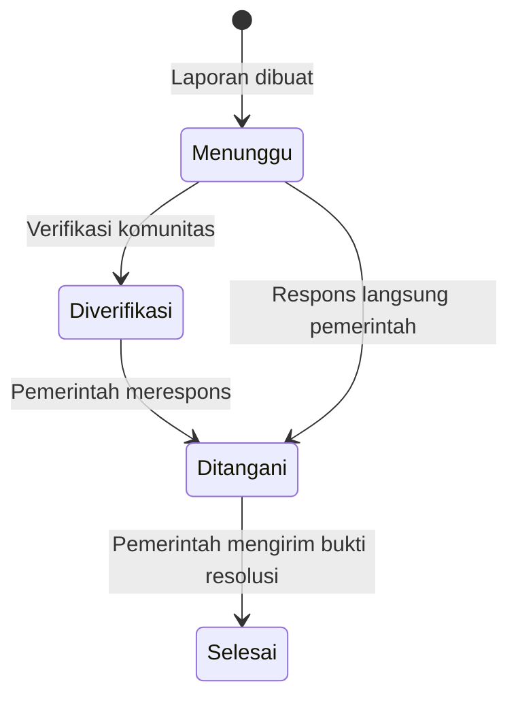
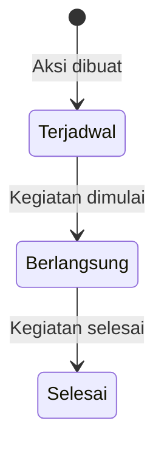

# Diagram Relasi Entitas

Dokumen ini menjelaskan skema database yang digunakan oleh SIAGA. Database di-host pada Supabase (PostgreSQL) dan dikelola melalui 14 file migrasi SQL sekuensial (migrasi 008 dihapus bersamaan dengan penghentian fitur Budget Watch).

---

## Diagram ER

---

## Deskripsi Tabel

### Tabel Inti

| Tabel | Deskripsi | RLS |
|---|---|---|
| `users_metadata` | Profil pengguna yang terhubung ke Supabase Auth via `auth_id`. Menyimpan lokasi, eco-points, badge gamifikasi, dan field khusus pemerintah (NIP, jabatan, instansi). Mendukung tiga peran: `user`, `pemerintah`, `admin`. | Ya |
| `reports` | Laporan masalah yang dibuat oleh warga. Berisi koordinat GPS, kategori, skor urgensi, alur status, URL foto, dan **field bukti resolusi** (`resolution_notes`, `resolution_image_url`) untuk verifikasi pemerintah. | Ya |
| `actions` | Aksi positif komunitas. Melacak peserta, poin, status verifikasi, dan foto sebelum/sesudah. | Ya |
| `comments` | Komentar polimorfik pada laporan dan aksi via `target_id` + `target_type`. | Ya |

### Tabel Relasi

| Tabel | Deskripsi | Constraint |
|---|---|---|
| `report_votes` | Melacak user mana yang mendukung laporan mana. | `UNIQUE(user_id, report_id)` |
| `report_verifications` | Melacak user mana yang memverifikasi laporan mana. | `UNIQUE(report_id, user_id)` |
| `action_participants` | Melacak user mana yang bergabung ke aksi mana. | `UNIQUE(action_id, user_id)` |
| `bookmarks` | Bookmark polimorfik untuk laporan, aksi, dan artikel info. | `UNIQUE(user_id, ref_type, ref_id)` |

### Tabel Sistem

| Tabel | Deskripsi |
|---|---|
| `notifications` | Inbox notifikasi in-app dengan status baca/belum baca. Mereferensi entitas sumber via `ref_type` dan `ref_id`. |
| `device_tokens` | Registri token push notification. Setiap perangkat mendaftarkan Expo push token-nya. Mendukung pembersihan otomatis token tidak valid. |
| `feedbacks` | Pengiriman feedback pengguna dengan klasifikasi tipe dan rating bintang 1-5. |

### Tabel Konten

| Tabel | Deskripsi |
|---|---|
| `info_articles` | Artikel edukasi dan informasi dengan konten JSONB yang kaya, metadata penulis, statistik, dan status verifikasi. |

### Fungsi

| Fungsi | Deskripsi |
|---|---|
| `increment_eco_points(p_user_id, p_amount)` | Fungsi PostgreSQL atomik untuk penambahan eco-points bebas race condition. Dipanggil via Supabase RPC. |
| `update_updated_at_column()` | Fungsi trigger yang otomatis memperbarui `updated_at` saat modifikasi baris. |

---

## Alur Status

### Status Laporan

### Status Aksi

---

## Indeks

Indeks kritis performa didefinisikan pada:

- **Lookup**: `auth_id`, `user_id`, `report_id`, `action_id`, `target_id`
- **Sorting**: `created_at DESC` pada semua tabel utama
- **Filtering**: `status`, `category`, `role`
- **Geospasial**: `(lat, lng)` pada reports untuk query terdekat
- **Notifikasi**: Partial index pada `(user_id, is_read) WHERE is_read = FALSE` untuk jumlah belum dibaca yang cepat

---

## Riwayat Migrasi

| # | File | Deskripsi |
|---|---|---|
| 001 | `create_users_metadata.sql` | Profil pengguna, RLS, trigger updated_at |
| 002 | `create_reports.sql` | Tabel laporan dengan indeks geospasial |
| 003 | `create_actions.sql` | Tabel aksi positif |
| 004 | `create_comments.sql` | Komentar polimorfik |
| 005 | `create_report_votes.sql` | Deduplikasi vote |
| 006 | `create_feedbacks.sql` | Feedback pengguna |
| 007 | `create_notifications.sql` | Inbox notifikasi |
| ~~008~~ | ~~`create_budget.sql`~~ | ~~Dihapus — Budget Watch dihentikan~~ |
| 009 | `add_user_role.sql` | Enum dan kolom role |
| 010 | `verify_join_bookmark.sql` | Verifikasi, partisipasi, bookmark |
| 011 | `info_articles.sql` | Artikel dengan data seed |
| 012 | `create_device_tokens.sql` | Registri push token |
| 013 | `increment_eco_points.sql` | Fungsi RPC increment atomik |
| 014 | `add_gov_profile_fields.sql` | Kolom profil khusus pemerintah |
| 015 | `add_report_resolution_proof.sql` | Kolom bukti resolusi pada reports |
