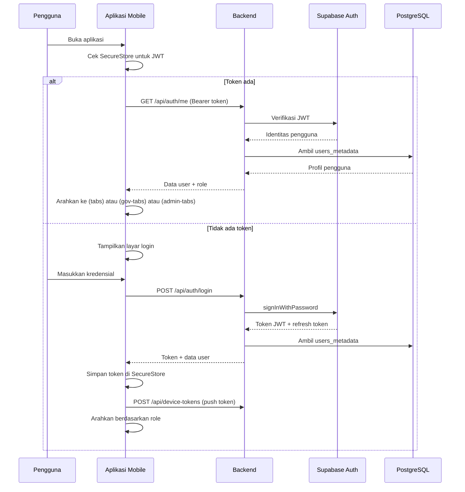
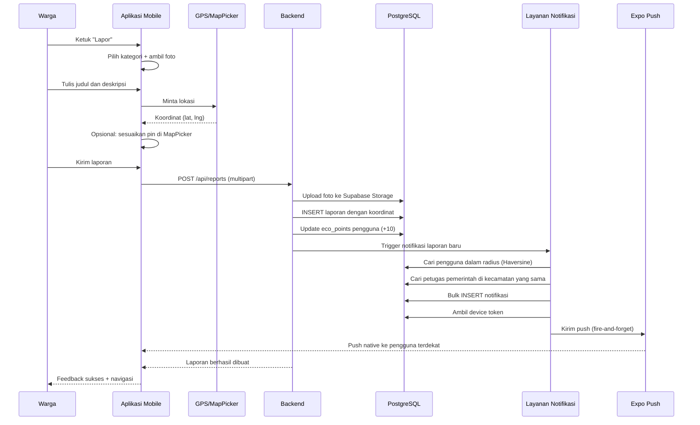
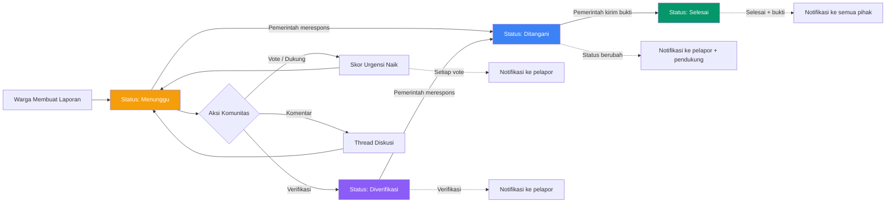
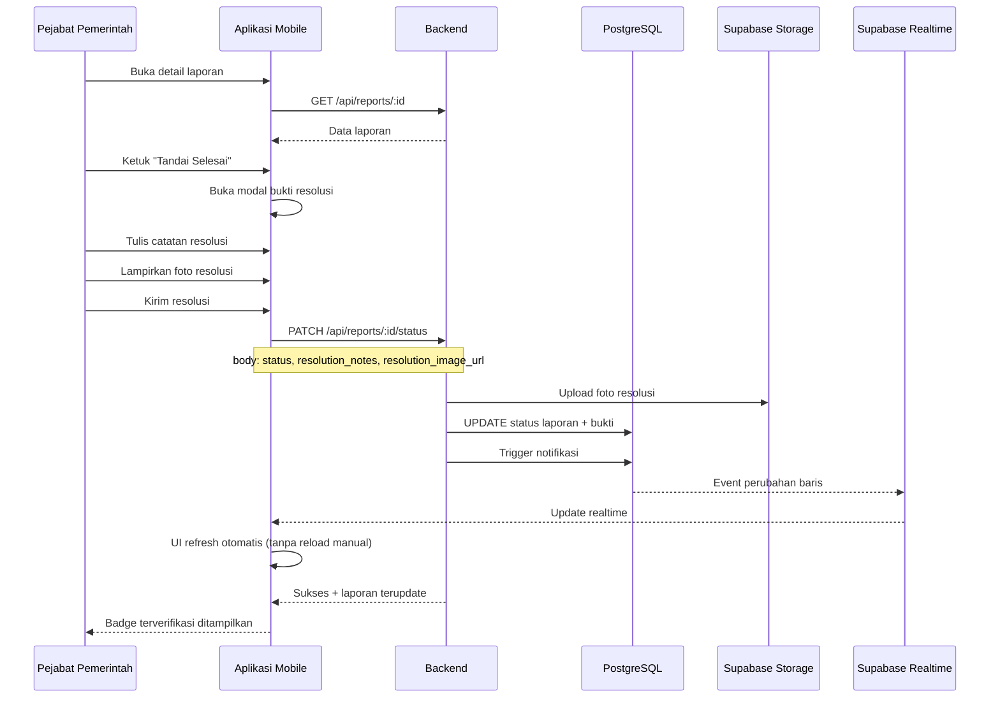
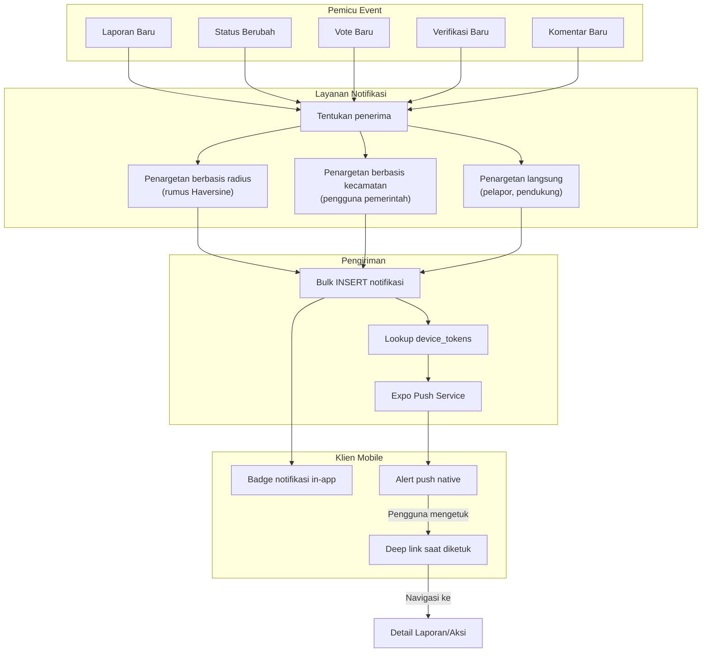
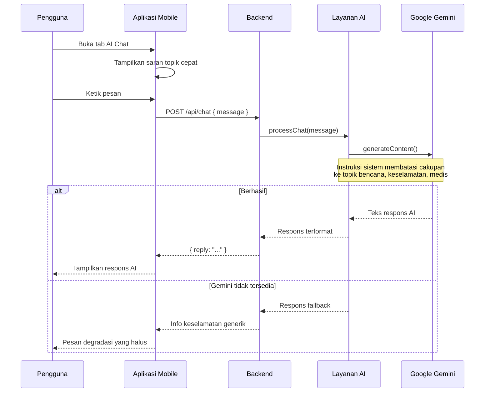
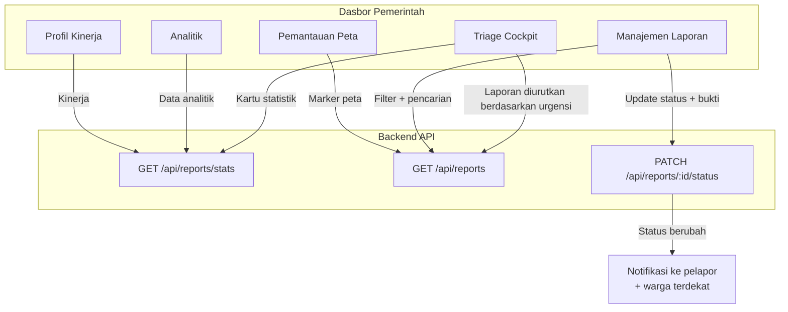
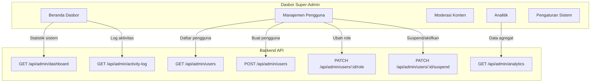
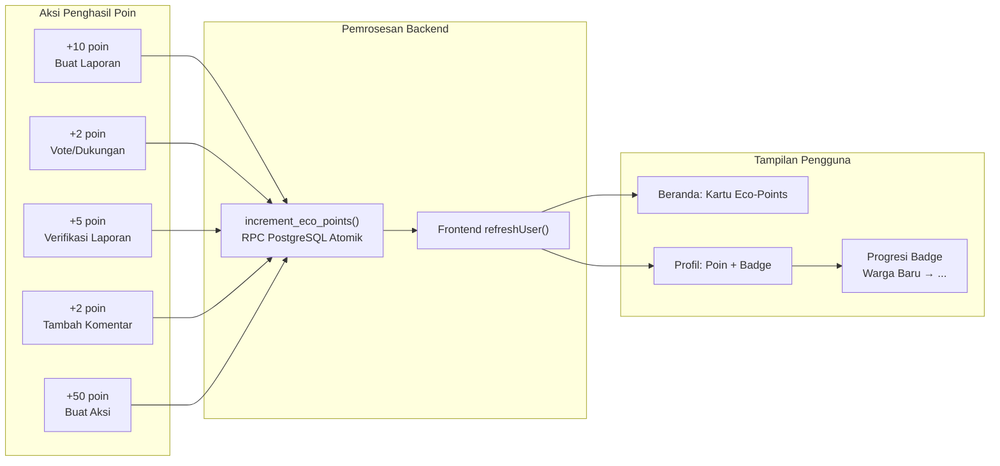
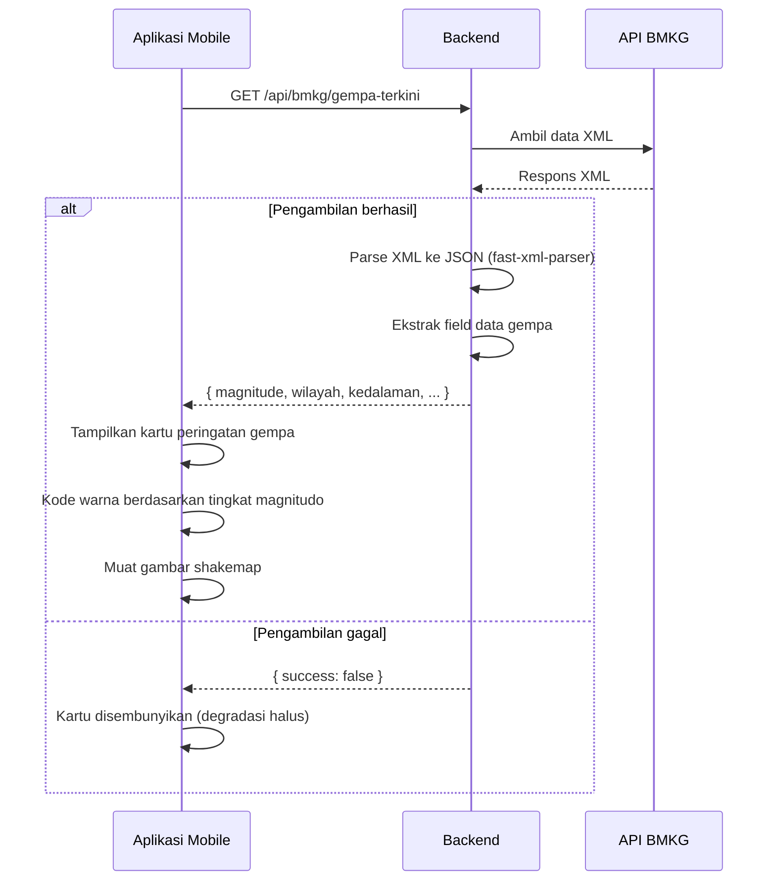

# Diagram Alur Sistem

Dokumen ini menjelaskan perjalanan pengguna utama dan alur proses dalam SIAGA.

---

## 1. Alur Autentikasi

---

## 2. Alur Pembuatan Laporan

---

## 3. Siklus Hidup Laporan

---

## 4. Alur Bukti Resolusi Pemerintah

---

## 5. Alur Push Notification

---

## 6. Alur AI Chat

---

## 7. Alur Dasbor Pemerintah

---

## 8. Alur Dasbor Admin

---

## 9. Alur Eco-Points

---

## 10. Integrasi Gempa BMKG

